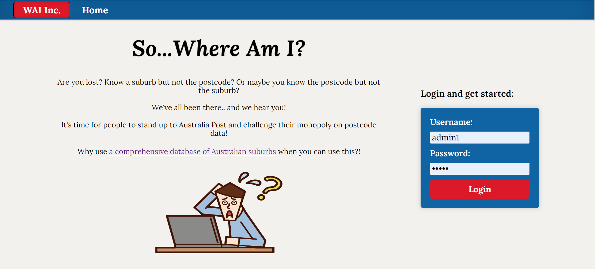

# # Where Am I?

### NOTE:
*This is a React / TS frontend for my 'Where am I?' project and requires access to the [backend here](https://github.com/TimBroderick44/WhereAmI-Backend).

This React / TypeScript frontend allows users to search for postcodes and get their associated auburbs and vice versa. Users can also log in as an admin and create, update and delete entries. 

## Screenshots
 
 
 
 


## Highlights
- **Modern React/TypeScript Frontend**: Provides a more dynamic and interactive user experience.
- **User-Friendly Navigation**: Nav at the top of the screen allows for seamless navigation.
- **Seamless Integration**: Works in conjunction with the [backend](https://github.com/TimBroderick44/WhereAmI-Backend)
- **Aesthetic Design**: Features a clean, intuitive, and visually appealing interface, enhancing the overall user experience.
  
## How to Get Started

1. **Clone the Repository**:
    ```sh
    git clone git@github.com:TimBroderick44/WhereAmI-Frontend.git
    ```
2. **Install Dependencies**:
    ```sh
    cd WhereAmI-Frontend
    npm install
    ```
3. **Setup and Run the Backend**
   
   Follow the steps [here](https://github.com/TimBroderick44/WhereAmI-Backend) and setup the backend. 

4. **Run in Development Mode**
    ```sh
    npm run dev
    ```
    Follow the provided link in your console and enjoy!

## Lessons Learned
- The importance and necessity of how data is presented from the backend to the frontend. E.g. the way that data is presented and obtained from an endpoint may look clean and organised; however, is difficult to implement on the frontend and does not consider UI/UX

## Difficulties
- Did not properly consider how the user would interact with the website and as a result, presenting and updating postcodes is not as smooth or the best it could be. 

## Future Implementations
- Alter the backend in the way that data is presented to the frontend and update the frontend to accomodate for the change. 
- Implement a users tab on the admin page (the backend endpoints already exist)
